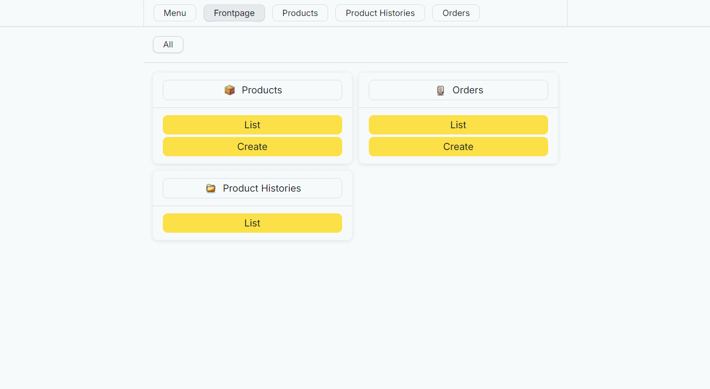

# Dotnet 8.0 React Order Display System

## Table of Contents
1. [Local Setup](#run-locally)
2. [Features](#features)
3. [Demo Videos](#demo-videos)
4. [Sample Code](#code-samples)
  - [Domain Models](#domain-models)
  - [Value Objects](#value-objects)
  - [Resusable Application Layer Validators](#resusable-application-layer-validators)
  - [CQRS Application Layer Architecture](#CQRS-application-layer-architecture)
  - [Controller Error Delegation](#controller-error-delegation)
  - [API Model Service](#api-model-service)
  - [Controller Presenter Pattern React Components](#controller-presenter-pattern-react-components)
  - [Composable React Components](#composable-react-components)
  - [Frontend Request Error Handling](#frontend-request-error-handling)
5. [Lessons Learned](#lessons-learned)
6. [API Reference](#api-reference)
    - [Products API](#products-api-endpoints)
    - [Orders API](#orders-api-endpoints)
    - [Draft Images API](#draft-images-api-endpoints)
    - [Product Histories API](#product-histories-api-endpoints)
7. [Error Handling](#error-handling)
8. [Authentication](#authentication)

## Run Locally

### Project Setup

1. Clone the project
```bash
git clone https://github.com/m-7ard/Dotnet-React-Order-Display-System-.git
```

2. Configure Environment Files
   - In the "Api" folder, create a `.env` file based on `.env_pattern` with your MSSQL database access data
   - In the "frontend" folder, create a `.env` file based on `.env_pattern` with the host URL if necessary

3. Backend Setup
```bash
# Restore NuGet dependencies
dotnet restore

# Navigate to API directory
cd Api

# Run the backend server
dotnet watch run
# OR for release
dotnet publish -c Release
```

4. Frontend Setup
```bash
# Navigate to frontend directory
cd frontend

# Install dependencies
npm install

# Start frontend server
npm run dev
```

## Features

- Product Management
- Automatic Product Histories / Archives
- Order Management
- Product Image Upload and Management
- Backend Integration Tests
- Backend Application Layer Unit Tests
- Frontend Validation
- Frontend Request Error Handling

## Technical Stack
### Backend
- Framework: .NET Core 8.0, ASP.NET MVC
- ORM: Entity Framework Core with MSSQL
- Architecture: CQRS with MediatR
- Validation: FluentValidation
- Testing: xUnit, Moq
### Frontend
- UI: React, Typescript
- React Libs: Tanstack Query, Tanstack Router
- CSS: Tailwind CSS, SCSS
- Other: Superstruct, neverthrow, jsonpointer, typebox

## Architecture
The application follows Clean Architecture principles with distinct layers:
- MVC (Presentation Layer)
- Application (Business Logic, Business Logic-Linked Validation)
- Domain (Business Rules)
- Infrastructure (Data Access)

## Demo Videos

### Main Workflow


### Filter Products


## Sample Code

### Domain Models
Example of rich domain model with encapsulated business rules:
```csharp
public class Order
{
    public Order(Guid id, decimal total, List<OrderItem> orderItems, OrderStatus status, int serialNumber, OrderDates orderDates)
    {
        Id = id;
        Total = total;
        OrderItems = orderItems;
        Status = status;
        SerialNumber = serialNumber;
        OrderDates = orderDates;
    }

    public Guid Id { get; private set; }
    public int SerialNumber { get; private set; }
    public decimal Total { get; set; }
    public OrderStatus Status { get; set; }
    public OrderDates OrderDates { get; set; }
    public List<OrderItem> OrderItems { get; set; }
    public List<DomainEvent> DomainEvents { get; set; } = [];
    public void ClearEvents()
    {
        DomainEvents = [];
    }

    private Dictionary<string, List<OrderStatus>> ValidStatusStatusTransitions = new Dictionary<string, List<OrderStatus>>()
    {
        { OrderStatus.Pending.Name, [OrderStatus.Finished] },
        { OrderStatus.Finished.Name, [] },
    };
    
    public OneOf<OrderStatus, string> CanTransitionStatus(string value)
    {
        var statusCreationResult = OrderStatus.CanCreate(value);
        if (statusCreationResult.TryPickT1(out var errors, out var _))
        {
            return errors;
        }

        if (!ValidStatusStatusTransitions.TryGetValue(Status.Name, out var transitionList))
        {
            return $"Invalid status transition from {Status.Name} to {value}.";
        }

        var newStatusObject = transitionList.Find(status => status.Name == value); 
        if (newStatusObject is null)
        {
            return $"Invalid status transition from {Status.Name} to {value}.";
        }

        return newStatusObject;
    }

    public void ExecuteTransitionStatus(string value)
    {
        var canTransitionStatus = CanTransitionStatus(value);
        if (canTransitionStatus.TryPickT1(out var error, out var newStatus))
        {
            throw new Exception(error);
        }

        Status = newStatus;
    }

    public OneOf<bool, string> CanAddOrderItem(Product product, ProductHistory productHistory, int quantity)
    {
        if (product.Id != productHistory.ProductId)
        {
            return "Product History's Product Id does not match Product Id.";
        }

        if (!productHistory.IsValid())
        {
            return $"Product History for Product of Id \"{product.Id}\" is not valid.";
        }

        if (quantity <= 0)
        {
            return "Order Item quantity must be greater than 0";
        }

        var existingOrderItem = OrderItems.Find(orderItem => orderItem.ProductId == product.Id);
        if (existingOrderItem is not null)
        {
            return "Product has already been added as an Order Item.";
        }

        return true;
    }

    public OrderItem ExecuteAddOrderItem(Product product, ProductHistory productHistory, int quantity) 
    {
        var canAddOrderItemResult = CanAddOrderItem(product: product, productHistory: productHistory, quantity: quantity);
        if (canAddOrderItemResult.TryPickT1(out var error, out var _))
        {
            throw new Exception(error);
        }

        var orderItem = OrderItemFactory.BuildNewOrderItem(
            id: Guid.NewGuid(),
            orderId: Id,
            quantity: quantity,
            status: OrderItemStatus.Pending,
            productHistoryId: productHistory.Id,
            productId: productHistory.ProductId
        );

        Total += productHistory.Price * quantity;
        OrderItems.Add(orderItem);

        return orderItem;
    }

    public OrderItem? GetOrderItemById(Guid id)
    {
        return OrderItems.Find(orderItem => orderItem.Id == id);
    }
}
```

### Value Objects
Example of value objects to enforce constraints between related fields
```csharp
public class OrderDates
{
    public OrderDates(DateTime dateCreated, DateTime? dateFinished)
    {
        DateCreated = dateCreated;
        DateFinished = dateFinished;
    }

    public DateTime DateCreated { get; }
    public DateTime? DateFinished { get; }

    public static OneOf<bool, string> CanCreate(DateTime dateCreated, DateTime? dateFinished)
    {
        if (dateCreated > DateTime.Now)
        {
            return "Date created cannot be larger than current date.";
        }

        if (dateFinished is not null && dateFinished < dateCreated)
        {
            return "Date finished cannot be smaller than date created";
        }

        return true;
    }

    public static OrderDates ExecuteCreate(DateTime dateCreated, DateTime? dateFinished)
    {
        var canCreateResult = CanCreate(dateCreated, dateFinished);
        if (canCreateResult.TryPickT1(out var error, out var _))
        {
            throw new Exception(error);
        }

        return new OrderDates(dateCreated: dateCreated, dateFinished: dateFinished);
    }
}
```

### Resusable Application Layer Validators
```csharp
public class OrderExistsValidatorAsync : IValidatorAsync<Guid, Order>
{
    private readonly IOrderRepository _orderRepository;

    public OrderExistsValidatorAsync(IOrderRepository orderRepository)
    {
        _orderRepository = orderRepository;
    }

    public async Task<OneOf<Order, List<ApplicationError>>> Validate(Guid input)
    {
     var order = await _orderRepository.GetByIdAsync(input);

        if (order is null)
        {
            return ApplicationErrorFactory.CreateSingleListError(
                message: $"Order of Id \"{input}\" does not exist.",
                code: ApplicationValidatorErrorCodes.ORDER_EXISTS_ERROR,
                path: []
            );
        }

        return order;
    }
}
```

### CQRS Application Layer Architecture
```csharp
public class MarkOrderFinishedHandler : IRequestHandler<MarkOrderFinishedCommand, OneOf<MarkOrderFinishedResult, List<ApplicationError>>>
{
    private readonly IOrderRepository _orderRepository;
  private readonly OrderExistsValidatorAsync _orderExistsValidator;

    public MarkOrderFinishedHandler(IOrderRepository orderRepository, OrderExistsValidatorAsync orderExistsValidator)
    {
        _orderRepository = orderRepository;
        _orderExistsValidator = orderExistsValidator;
    }

    public async Task<OneOf<MarkOrderFinishedResult, List<ApplicationError>>> Handle(MarkOrderFinishedCommand request, CancellationToken cancellationToken)
    {
        var orderExistsResult = await _orderExistsValidator.Validate(request.OrderId);
        if (orderExistsResult.TryPickT1(out var errors, out var order))
        {
            return errors;
        }

        var canMarkOrderFinishedResult = OrderDomainService.CanMarkFinished(order);
        if (canMarkOrderFinishedResult.TryPickT1(out var error, out var _))
        {
            return ApplicationErrorFactory.CreateSingleListError(
                message: error,
                path: [],
                code: ApplicationErrorCodes.NotAllowed
            );
        }

        OrderDomainService.ExecuteMarkFinished(order);
        await _orderRepository.UpdateAsync(order);
        return new MarkOrderFinishedResult(orderId: request.OrderId);
    }
}
```

### Controller Error Delegation
```csharp
[ApiController]
[AllowAnonymous]
[Route("api/orders/")]
public class OrdersController : ControllerBase
{
    private readonly ISender _mediator;
    private readonly IApiModelService _apiModelService;

    ...
    ...
    ...

    [HttpPut("{orderId}/item/{orderItemId}/mark_finished")]
    public async Task<ActionResult<MarkOrderItemFinishedResponseDTO>> MarkOrderItemFinished(Guid orderId, Guid orderItemId)
    {
        var query = new MarkOrderItemFinishedCommand(
            orderId: orderId,
            orderItemId: orderItemId
        );

        var result = await _mediator.Send(query);

        if (result.TryPickT1(out var errors, out var value))
        {
            var expectedError = errors.First();
            if (expectedError.Code is ApplicationValidatorErrorCodes.ORDER_EXISTS_ERROR)
            {
                return NotFound(PlainApiErrorHandlingService.MapApplicationErrors(errors));
            }


            return BadRequest(PlainApiErrorHandlingService.MapApplicationErrors(errors));
        };

        var response = new MarkOrderItemFinishedResponseDTO(orderId: value.OrderId.ToString(), orderItemId: value.OrderItemId.ToString());
        return Ok(response);
    }
}

```

### API Model Service
Example of API model service implementation with caching:

```csharp
public class ApiModelService : IApiModelService
{
    private readonly Dictionary<Guid, ProductHistory?> ProductHistoryCache = new Dictionary<Guid, ProductHistory?>();
    private readonly IProductHistoryRepository _productHistoryRepository;

    public ApiModelService(IProductHistoryRepository productHistoryRepository)
    {
        _productHistoryRepository = productHistoryRepository;
    }


    private async Task<ProductHistory?> GetProductHistoryFromCacheOrDb(Guid id) 
    {
        if (ProductHistoryCache.TryGetValue(id, out var cachedProductHistory))
        {
            return cachedProductHistory;
        } 

        var productHistory = await _productHistoryRepository.GetByIdAsync(id);
        ProductHistoryCache[id] = productHistory;
        return productHistory;
    }

    public async Task<OrderApiModel> CreateOrderApiModel(Order order)
    {
        var orderItems = new List<OrderItemApiModel>();

        foreach (var orderItem in order.OrderItems)
        {
            var productHistory = await GetProductHistoryFromCacheOrDb(orderItem.ProductHistoryId);
            if (productHistory == null)
            {
                throw new Exception($"ProductHistory of Id \"{orderItem.ProductHistoryId}\" from OrderItem of Id \"${orderItem.Id}\"");
            }

            orderItems.Add(ApiModelMapper.OrderItemToApiModel(orderItem, productHistory));
        }
        
        return ApiModelMapper.OrderToApiModel(order, orderItems);
    }

    public async Task<List<OrderApiModel>> CreateManyOrderApiModel(List<Order> orders)
    {
        var orderApiModels = new List<OrderApiModel>();
        
        foreach (var order in orders)
        {
            orderApiModels.Add(await CreateOrderApiModel(order));
        }

        return orderApiModels;
    }
}
```

### Controller Presenter Pattern React Components
Example of a Controller - Presenter architecture in React:
```tsx
/////////////////////////////////
// CreateOrder.Controller.tsx
/////////////////////////////////

const validatorSchema = Type.Object({
    orderItemData: Type.Record(
        Type.String({ minLength: 1 }),
        Type.Object({
            productId: Type.String({ minLength: 1 }),
            quantity: Type.Number({ minimum: 1 }),
        }),
        { minProperties: 1, suffixPath: "/_" },
    ),
});

export interface ValueSchema {
    orderItemData: {
        [productId: number | string]: {
            product: IProduct;
            quantity: number;
        };
    };
}

export type ErrorState = IPresentationError<{
    orderItemData: {
        [productId: number | string]: {
            productId: string[];
            quantity: string[];
        };
    };
}>;

const initialValues: ValueSchema = {
    orderItemData: {},
};

const initialErrors: ErrorState = {};

export default function CreateOrderController(props: { orderDataAccess: IOrderDataAccess }) {
    const { orderDataAccess } = props;
    const responseHandler = useResponseHandler();

    const itemManager = useItemManager<ValueSchema>(initialValues);
    const errorManager = useItemManager<ErrorState>(initialErrors);

    const navigate = useNavigate();
    const createOrderMutation = useMutation({
        ...
    });

    return (
        <CreateOrderPage
            onSubmit={createOrderMutation.mutate}
            onReset={() => {
                itemManager.setAll(initialValues);
                errorManager.setAll(initialErrors);
            }}
            onChange={(value) => {
                itemManager.setAll(value);
            }}
            errors={errorManager.items}
            value={itemManager.items}
        />
    );
}

/////////////////////////////////
// CreateOrder.Page.tsx
/////////////////////////////////
export default function CreateOrderPage(props: {
    onSubmit: () => void;
    onReset: () => void;
    onChange: (value: ValueSchema) => void;

    errors: ErrorState;
    value: ValueSchema;
}) {
    const { onSubmit, onReset, errors, value, onChange } = props;

    const updateField = useCallback(
        <T extends keyof ValueSchema>(fieldName: T, fieldValue: ValueSchema[T]) => {
            const newFormValue = { ...value };
            newFormValue[fieldName] = fieldValue;
            onChange(newFormValue);
        },
        [onChange, value],
    );

    return (
        <MixinPage
            as="form"
            onSubmit={async (e) => {
                e.preventDefault();
                onSubmit();
            }}
            onReset={(e) => {
                e.preventDefault();
                onReset();
            }}
            options={{
                size: "mixin-page-base",
            }}
            className={`${CONTENT_GRID.CLASS}`}
        >
            <MixinPageSection className="flex flex-row gap-3 items-center">
                <LinkBox
                    parts={[
                        { isLink: true, to: routeData.listOrders.build({}), label: "Orders" },
                        { isLink: true, to: routeData.createOrder.build({}), label: "Create" },
                    ]}
                />
            </MixinPageSection>
            <Divider />
            <MixinPageSection className="flex flex-col gap-3">
                <div className="token-default-title">Create Order</div>
                <FormError title="Failed to Create Order" errors={errors._} />
                <FormField name="orderItemData" errors={errors.orderItemData?._}>
                    <OrderItemDataField
                        value={value.orderItemData}
                        errors={errors.orderItemData}
                        onChange={(value) => {
                            updateField("orderItemData", value);
                        }}
                    />
                </FormField>
            </MixinPageSection>
            <Divider />
            <MixinPageSection className="flex flex-row gap-3 justify-end">
                <MixinButton options={{ size: "mixin-button-base", theme: "theme-button-generic-white" }} type="reset">
                    Reset
                </MixinButton>
                <MixinButton options={{ size: "mixin-button-base", theme: "theme-button-generic-green" }} type="submit">
                    Submit
                </MixinButton>
            </MixinPageSection>
        </MixinPage>
    );
}
```

### Composable React Components
Example of composable components through props
```tsx
interface IMixinButtonProps extends React.ButtonHTMLAttributes<HTMLButtonElement> {
    options: {
        size: "mixin-button-sm" | "mixin-button-base";
        theme?: "theme-button-generic-white" | "theme-button-generic-yellow" | "theme-button-generic-green" | "theme-button-generic-red";
    };
    isStatic?: boolean;
    active?: boolean;
    hasShadow?: boolean;
}

export default function MixinButton(props: PropsWithChildren<IMixinButtonProps>) {
    const { options, active = false, className, isStatic = false, hasShadow = false, children, ...HTMLattrs } = props;

    const staticMixinClass = isStatic ? "mixin-button-like--static" : "";
    const staticThemeClass = isStatic ? `${options.theme}--static` : "";
    const hasShadowClass = hasShadow ? `shadow` : "";

    return (
        <button data-active={active} className={["mixin-button-like", options.size, options.theme, className, staticMixinClass, staticThemeClass, hasShadowClass].join(" ")} {...HTMLattrs}>
            {children}
        </button>
    );
}

```

```tsx
type MixinPrototypeCardProps<E extends ElementType> = PolymorphicProps<E> & {
    options: {
        size: "mixin-Pcard-base";
        theme: "theme-Pcard-generic-white";
    };
    hasShadow?: boolean;
    hasBorder?: boolean;
    hasDivide?: boolean;
};

export default function MixinPrototypeCard<T extends ElementType = "div">(props: PropsWithChildren<MixinPrototypeCardProps<T>>) {
    const { options, as, className, hasShadow = false, hasBorder = false, hasDivide = false, ...HTMLattrs } = props;
    const Component = as ?? "div";

    const shadowClass = hasShadow ? "token-default-shadow" : "";
    const borderClass = hasBorder ? "border token-default-border-color" : "";
    const divideClass = hasDivide ? "divide-y token-default-divide-color" : "";

    return (
        <Component className={["mixin-Pcard-like", options.size, options.theme, className, shadowClass, borderClass, divideClass].join(" ")} {...HTMLattrs}>
            {props.children}
        </Component>
    );
}

type MixinPrototypeCardSectionProps<E extends ElementType> = PolymorphicProps<E> & { fillBg?: boolean };

export function MixinPrototypeCardSection<T extends ElementType = "section">(props: PropsWithChildren<MixinPrototypeCardSectionProps<T>>) {
    const { as, className, fillBg = false, ...HTMLattrs } = props;
    const Component = as ?? "section";

    const bgClass = fillBg ? "bg-white" : "";

    return (
        <Component className={[className, bgClass].join(" ")} {...HTMLattrs} data-role="Pcard-section">
            {props.children}
        </Component>
    );
}
```

### Frontend Request Error Handling
Example of automatically handling different request failures and / or exceptions
```tsx
export default function useResponseHandler() {
    const { dispatchException } = useApplicationExceptionContext();

    return useCallback(
        async <SuccessType, ErrorType, FallbackType>(props: {
            requestFn: () => Promise<Response>;
            onResponseFn: (response: Response) => Promise<Result<SuccessType, ErrorType>>;
            fallbackValue?: FallbackType;
        }) => {
            const { requestFn, onResponseFn, fallbackValue } = props;

            try {
                const responseResult = await tryHandleRequest(requestFn());
                if (responseResult.isErr()) {
                    dispatchException(responseResult.error);
                    return fallbackValue;
                }

                const response = responseResult.value;
                const result = await onResponseFn(response);
                if (result.isOk()) {
                    return result.value;
                }

                const error = await handleInvalidResponse(response);
                dispatchException(error);
                return result.error;
            } catch (err: unknown) {
                dispatchException(err);
                return fallbackValue;
            }
        },
        [dispatchException],
    );
}
```

## Lessons Learned

### The Value of Unit Tests and Integration Tests

The application underwent a significant refactoring process, which included:
- Changing autoincrement keys to GUID
- Creating domain events
- Implementing domain methods

Unit Tests and Integration Tests were crucial in ensuring the correctness of the refactoring, making the process much more manageable.

### Separating Component Logic and UI Views

The project moved from a single component architecture to a Presenter-Controller component architecture in React, which:
- Clearly separates state and fetch-related logic from views
- Improves component testability
- Increases component reusability

### Meaningful Errors in the Application Layer

The application uses validation error codes in the application layer, allowing for:
- Delegating appropriate responses in controllers
- More precise error handling

## API Reference

### Products API Endpoints

#### Create Product
`POST /api/products/create`

**Request Body**:

| Field | Type | Description | Constraints |
|-------|------|-------------|-------------|
| name | string | Product name | Required, max length validation |
| price | decimal | Product price | Required, positive value |
| description | string | Product description | Optional |
| images | List&lt;string&gt; | Image URLs | Max 8 images |

**Responses**:
- `201 Created`: Product successfully created
- `400 Bad Request`: Validation errors

#### List Products
`GET /api/products/list`

**Query Parameters**:

| Parameter | Type | Description |
|-----------|------|-------------|
| id | Guid | Filter by specific product ID |
| name | string | Filter by product name |
| minPrice | decimal | Minimum price filter |
| maxPrice | decimal | Maximum price filter |
| description | string | Filter by product description |
| createdBefore | DateTime | Filter products created before date |
| createdAfter | DateTime | Filter products created after date |
| orderBy | string | Sort products by specific field |

**Responses**:
- `200 OK`: Returns list of products
- `400 Bad Request`: Invalid query parameters

(Other endpoints like Read, Update, and Delete Product are omitted for brevity)

### Orders API Endpoints

#### Create Order
`POST /api/orders/create`

**Request Body**:

| Parameter | Type | Description |
|-----------|------|-------------|
| orderItemData | object | Dictionary of order items |
| orderItemData[uid].productId | string | ID of the product |
| orderItemData[uid].quantity | number | Quantity of the product |

(Other order-related endpoints are omitted for brevity)

### Draft Images API Endpoints

#### Upload Images
`POST /api/draft_images/upload_images`

**Request Body**:

| Parameter | Type | Description |
|-----------|------|-------------|
| files | file[] | List of image files to upload |

**Constraints**:
- Maximum 8 files per upload
- Maximum 8 MB per file
- Allowed extensions: .jpg, .jpeg, .png

### Product Histories API Endpoints

#### List Product Histories
`GET /api/product_histories/list`

**Query Parameters**:

| Parameter | Type | Description |
|-----------|------|-------------|
| name | string | Filter by product name |
| minPrice | number | Minimum product price |
| maxPrice | number | Maximum product price |
| description | string | Filter by product description |
| validTo | datetime | Products valid before this date |
| validFrom | datetime | Products valid after this date |
| productId | string | Filter by specific product ID |
| orderBy | string | Specify ordering of results |

## Error Handling

The API returns structured error responses including:
- Error codes
- Detailed error messages
- Paths to specific validation errors

### Common Error Codes

- `ModelDoesNotExist`: Requested resource not found
- `IntegrityError`: Database integrity constraint violation

## Authentication

Currently, the endpoint allows anonymous access.