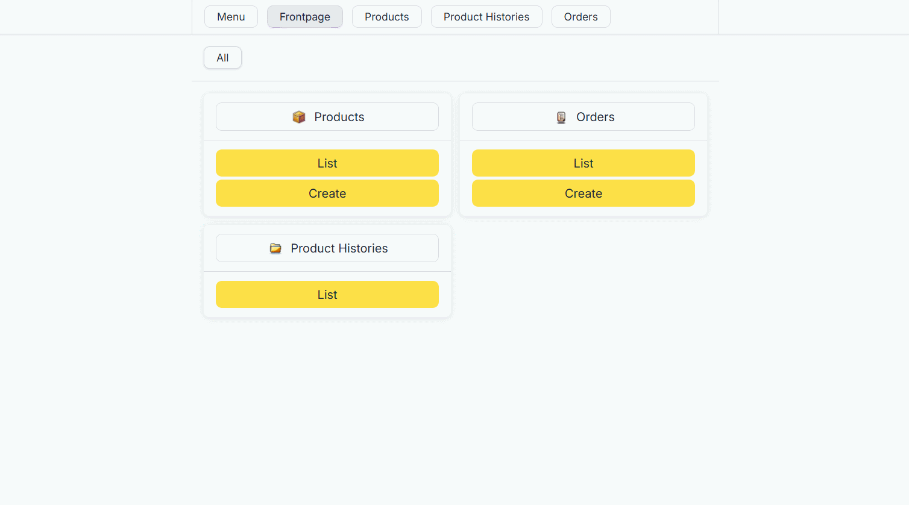
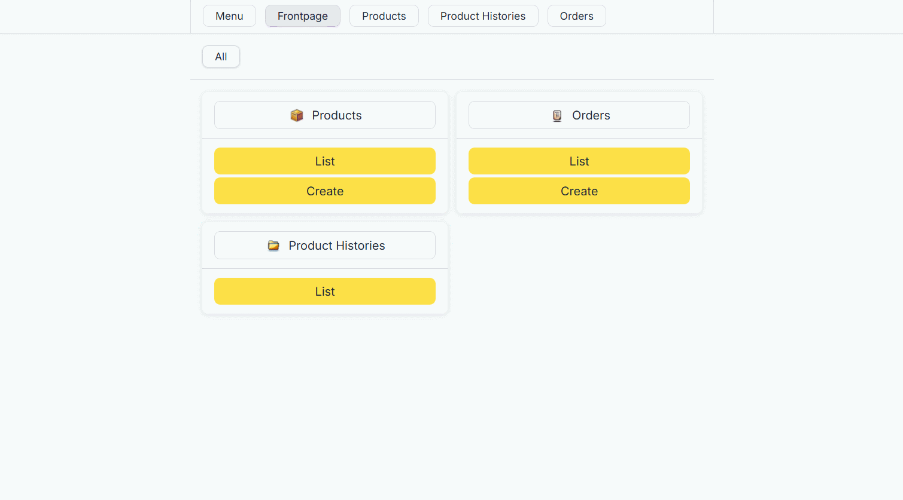
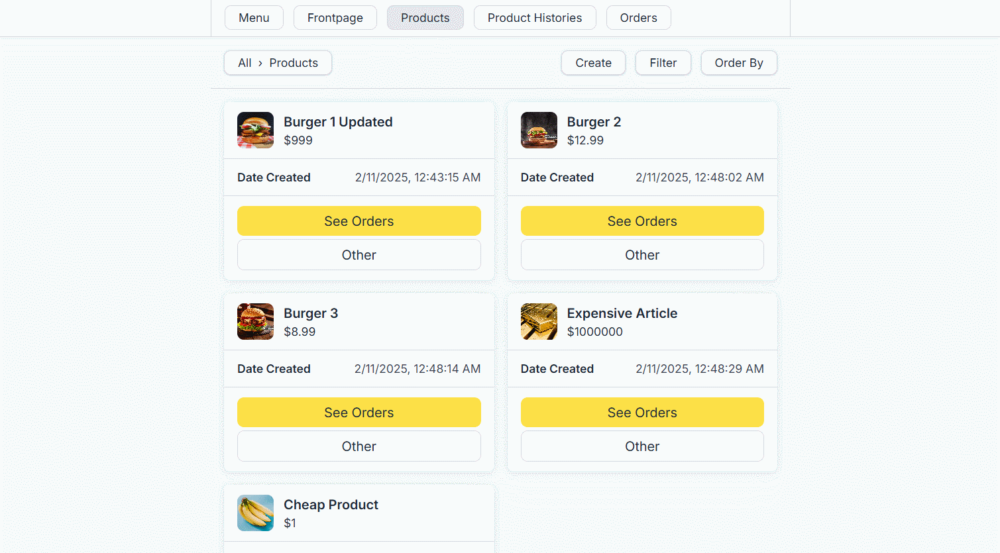

# Dotnet 8.0 React Order Display System

## Table of Contents
1. [Defaults](#defaults)
2. [Override Defaults](#override-defaults)
3. [Local Setup](#run-locally)
4. [Features](#features)
5. [Demo Videos](#demo-videos)
6. [Sample Code](#code-samples)
    - [Domain Models](#domain-models)
    - [Value Objects](#value-objects)
    - [Resusable Application Layer Validators](#resusable-application-layer-validators)
    - [CQRS Application Layer Architecture](#CQRS-application-layer-architecture)
    - [Database Cross Compatability](#database-cross-compatibility)
    - [API Model Service](#api-model-service)
    - [Controller Presenter Pattern React Components](#controller-presenter-pattern-react-components)
    - [Composable React Components](#composable-react-components)
    - [Frontend Request Error Handling](#frontend-request-error-handling)
    - [Common Interface for Frontend Router](#common-interface-for-frontend-router)
7. [Lessons Learned](#lessons-learned)
8. [API Reference](#api-reference)
    - [Products API](#products-api-endpoints)
    - [Orders API](#orders-api-endpoints)
    - [Draft Images API](#draft-images-api-endpoints)
    - [Product Histories API](#product-histories-api-endpoints)
9. [Error Handling](#error-handling)
10. [Authentication](#authentication)

## Defaults
### Backend
- When running docker, the port will be 5000

- When running the dev server, the port will be 5102
- The default database is SQLite, for both production and testing.

- When running docker, Media is stored in a volume /app/media
- When the dev server, Media is stored in a folder at /Files/Media in production, and /Files/Media/Tests when testing.

- The databse and media are cleared / reset on each startup.

### Frontend
- When running docker, the api url will be http://localhost:5000
- When running the dev server, the api url will be http://localhost:5102

- The application uses a Tanstack Router by default

## Override Defaults
### Backend
- To change the docker port, go to docker-compose.yml and fill in your desired port, then, go to frontend\.env.production to reflect the new port

- To change the production and development database, go to Api\appsettings.json and change Database:Provider to either "SqlServer" or "Sqlite", then, change the matching ${provider}_Database string to your connection string
- To change the testing database, do the same as above but withing the Testing section

## Local Setup
### Project Setup

1. Clone the project
```bash
git clone https://github.com/m-7ard/Dotnet-React-Order-Display-System-.git
```

2.A Use Docker
```bash
docker compose up
```

2.B Use Dev Server

3. Backend Setup
```bash
# Restore NuGet dependencies
dotnet restore

# Navigate to API directory
cd Api

# Run the backend server
dotnet watch run
# OR for release
dotnet publish -c Release
```

4. Frontend Setup
```bash
# Navigate to frontend directory
cd frontend

# Install dependencies
npm install

# Start frontend server
npm run dev
```

## Features
- Product Management
- Automatic Product Histories / Archives
- Order Management
- Database cross-compatibility
- Product Image Upload and Management
- Value Objects to Enforce Business Rules
- Injectable Validators to Reuse Application Logic
- Backend Integration Tests
- Backend Application Layer Unit Tests
- Common interface for frontend routers
- Frontend Validation
- Frontend Request Error Handling

## Technical Stack
### Backend
- Framework: .NET Core 8.0, ASP.NET Web APIs
- ORM: Entity Framework Core with MSSQL or Sqlite
- Architecture: CQRS with MediatR, Domain Driven Design
- Validation: FluentValidation, Value Objects, Domain Methods
- Testing: xUnit, Moq
### Frontend
- UI: React, Typescript
- React Libs: Tanstack Query, Tanstack Router
- CSS: Tailwind CSS, SCSS
- Other: Superstruct, neverthrow, jsonpointer, typebox

## Architecture
The application follows Clean Architecture principles with distinct layers:
- API (Presentation Layer)
- Application (Business Logic, Business Logic-Linked Validation)
- Domain (Business Rules)
- Infrastructure (Data Access)

## Demo Videos

### Create Product


### Create Order


### Manage Order


### Update Product


### Order Products By


### Filter Products


## Sample Code

### Domain Models
Example of rich domain model with encapsulated business rules:

This Order domain features methods to manage its OrderItems. These methods will produce domain events as side effects, that will then later be used to repositories at the time of persistence

```csharp
public class Order
{
    public Order(OrderId id, Money total, List<OrderItem> orderItems, OrderStatus status, int serialNumber, OrderDates orderDates)
    {
        Id = id;
        Total = total;
        OrderItems = orderItems;
        Status = status;
        SerialNumber = serialNumber;
        OrderDates = orderDates;
    }

    public OrderId Id { get; private set; }
    public int SerialNumber { get; private set; }
    public Money Total { get; set; }
    public OrderStatus Status { get; set; }
    public OrderDates OrderDates { get; set; }
    public List<OrderItem> OrderItems { get; set; }

    public List<DomainEvent> DomainEvents { get; set; } = [];
    public void ClearEvents()
    {
        DomainEvents = [];
    }

    private Dictionary<string, List<OrderStatus>> ValidStatusStatusTransitions = new Dictionary<string, List<OrderStatus>>()
    {
        { OrderStatus.Pending.Name, [OrderStatus.Finished] },
        { OrderStatus.Finished.Name, [] },
    };
    
    public OneOf<OrderStatus, string> CanTransitionStatus(string value)
    {
        var statusCreationResult = OrderStatus.CanCreate(value);
        if (statusCreationResult.TryPickT1(out var errors, out var _))
        {
            return errors;
        }

        if (!ValidStatusStatusTransitions.TryGetValue(Status.Name, out var transitionList))
        {
            return $"Invalid status transition from {Status.Name} to {value}.";
        }

        var newStatusObject = transitionList.Find(status => status.Name == value); 
        if (newStatusObject is null)
        {
            return $"Invalid status transition from {Status.Name} to {value}.";
        }

        return newStatusObject;
    }

    public void ExecuteTransitionStatus(string value)
    {
        var canTransitionStatus = CanTransitionStatus(value);
        if (canTransitionStatus.TryPickT1(out var error, out var newStatus))
        {
            throw new Exception(error);
        }

        Status = newStatus;
    }

    public OneOf<bool, string> CanAddOrderItem(Guid id, Product product, ProductHistory productHistory, int quantity)
    {
        var canCreateOrderItemId = OrderItemId.CanCreate(id);
        if (canCreateOrderItemId.TryPickT1(out var error, out _))
        {
            return error;
        }

        var canCreateQuantity = Quantity.CanCreate(quantity);
        if (canCreateQuantity.TryPickT1(out error, out _))
        {
            return error;
        }

        var canCreateTotal = Money.CanCreate(productHistory.Price.Value * quantity);
        if (canCreateOrderItemId.TryPickT1(out error, out _))
        {
            return error;
        }


        if (product.Id != productHistory.ProductId)
        {
            return "Product History's Product Id does not match Product Id.";
        }

        if (!productHistory.IsValid())
        {
            return $"Product History for Product of Id \"{product.Id}\" is not valid.";
        }

        var existingOrderItem = OrderItems.Find(orderItem => orderItem.ProductId == product.Id);
        if (existingOrderItem is not null)
        {
            return "Product has already been added as an Order Item.";
        }

        return true;
    }

    public OrderItemId ExecuteAddOrderItem(Guid id, Product product, ProductHistory productHistory, int quantity, int serialNumber) 
    {
        var canAddOrderItemResult = CanAddOrderItem(id: id, product: product, productHistory: productHistory, quantity: quantity);
        if (canAddOrderItemResult.TryPickT1(out var error, out var _))
        {
            throw new Exception(error);
        }

        var orderItem = OrderItemFactory.BuildNewOrderItem(
            id: OrderItemId.ExecuteCreate(id),
            orderId: Id,
            quantity: Quantity.ExecuteCreate(quantity),
            status: OrderItemStatus.Pending,
            productHistoryId: productHistory.Id,
            productId: productHistory.ProductId,
            serialNumber: serialNumber
        );

        var addAmount = Money.ExecuteCreate(productHistory.Price.Value * quantity);

        Total += addAmount;
        OrderItems.Add(orderItem);

        return orderItem.Id;
    }

    public OneOf<OrderItem, string> TryGetOrderItemById(OrderItemId orderItemId)
    {
        var orderItem =  OrderItems.Find(orderItem => orderItem.Id == orderItemId);
        if (orderItem == null)
        {
            return $"Order Item of Id \"{orderItemId}\" does not exist on Order of Id \"{Id}\"";
        }

        return orderItem;
    }

    public OrderItem ExecuteGetOrderItemById(OrderItemId orderItemId)
    {
        var canGetOrderItemResult = TryGetOrderItemById(orderItemId);
        if (canGetOrderItemResult.TryPickT1(out var error, out var orderItem))
        {
            throw new Exception(error);
        }

        return orderItem;
    }
}
```

### Value Objects
Example of value objects to enforce constraints between related fields:

This value object enforces the logical values of the dates

```csharp
public class OrderDates
{
    public OrderDates(DateTime dateCreated, DateTime? dateFinished)
    {
        DateCreated = dateCreated;
        DateFinished = dateFinished;
    }

    public DateTime DateCreated { get; }
    public DateTime? DateFinished { get; }

    public static OneOf<bool, string> CanCreate(DateTime dateCreated, DateTime? dateFinished)
    {
        var currentDate = DateTime.UtcNow;
        if (dateCreated > DateTime.UtcNow)
        {
            return $"Date created ({ dateCreated }) cannot be larger than current date ({ currentDate }).";
        }

        if (dateFinished is not null && dateFinished < dateCreated)
        {
            return $"Date finished ({ dateFinished }) cannot be smaller than date created ({ dateCreated })";
        }

        return true;
    }

    public static OrderDates ExecuteCreate(DateTime dateCreated, DateTime? dateFinished)
    {
        var canCreateResult = CanCreate(dateCreated, dateFinished);
        if (canCreateResult.TryPickT1(out var error, out var _))
        {
            throw new Exception(error);
        }

        return new OrderDates(dateCreated: dateCreated, dateFinished: dateFinished);
    }
}
```

### Resusable Application Layer Validators

The following demonstrates a Validator, that takes an OrderId value object as argument to differentiate it from other values and then uses the repository to retrieve the order, or otherwise return a specific error code associated with the validator.

```csharp
public interface IOrderExistsValidator<InputType> 
{
    public Task<OneOf<Order, List<ApplicationError>>> Validate(InputType input);
}

public class OrderExistsByIdValidator : IOrderExistsValidator<OrderId>
{
    private readonly IOrderRepository _orderRepository;

    public OrderExistsByIdValidator(IOrderRepository orderRepository)
    {
        _orderRepository = orderRepository;
    }

    public async Task<OneOf<Order, List<ApplicationError>>> Validate(OrderId id)
    {
        var order = await _orderRepository.GetByIdAsync(id);

        if (order is null)
        {
            return ApplicationErrorFactory.CreateSingleListError(
                message: $"Order of Id \"{id}\" does not exist.",
                code: SpecificApplicationErrorCodes.ORDER_EXISTS_ERROR,
                path: []
            );
        }

        return order;
    }
}
```

### CQRS Application Layer Architecture

This handler demonstrated the implementation of a command handler that marks and order item as finished by utilising the common interface provided by the order

```csharp
public class MarkOrderItemFinishedHandler : IRequestHandler<MarkOrderItemFinishedCommand, OneOf<MarkOrderItemFinishedResult, List<ApplicationError>>>
{
    private readonly IOrderRepository _orderRepository;
    private readonly IOrderExistsValidator<OrderId> _orderExistsValidator;


    public MarkOrderItemFinishedHandler(IOrderRepository orderRepository, IOrderExistsValidator<OrderId> orderExistsValidator)
    {
        _orderRepository = orderRepository;
        _orderExistsValidator = orderExistsValidator;
    }

    public async Task<OneOf<MarkOrderItemFinishedResult, List<ApplicationError>>> Handle(MarkOrderItemFinishedCommand request, CancellationToken cancellationToken)
    {
        var orderId = OrderId.ExecuteCreate(request.OrderId);
        var orderExistsResult = await _orderExistsValidator.Validate(orderId);
        if (orderExistsResult.TryPickT1(out var errors, out var order))
        {
            return errors;
        }

        var orderItemId = OrderItemId.ExecuteCreate(request.OrderItemId);
        var canMarkOrderItemFinishedResult = OrderDomainService.CanMarkOrderItemFinished(order, orderItemId);
        if (canMarkOrderItemFinishedResult.TryPickT1(out var error, out var _))
        {
            return ApplicationErrorFactory.CreateSingleListError(
                message: error,
                path: [],
                code: GeneralApplicationErrorCodes.NOT_ALLOWED
            );
        }

        var dateFinished = OrderDomainService.ExecuteMarkOrderItemFinished(order, orderItemId);
        await _orderRepository.UpdateAsync(order);
        return new MarkOrderItemFinishedResult(orderId: request.OrderId, orderItemId: request.OrderItemId, dateFinished: dateFinished);
    }
}
```

### Controller Error Delegation

Through the use of application error code, we can delegate appropriate error codes from our controller

```csharp
[ApiController]
[AllowAnonymous]
[Route("api/orders/")]
public class OrdersController : ControllerBase
{
    private readonly ISender _mediator;
    private readonly IApiModelService _apiModelService;

    ...
    ...
    ...

    [HttpPut("{orderId}/item/{orderItemId}/mark_finished")]
    public async Task<ActionResult<MarkOrderItemFinishedResponseDTO>> MarkOrderItemFinished(Guid orderId, Guid orderItemId)
    {
        var query = new MarkOrderItemFinishedCommand(
            orderId: orderId,
            orderItemId: orderItemId
        );

        var result = await _mediator.Send(query);

        if (result.TryPickT1(out var errors, out var value))
        {
            var expectedError = errors.First();
            if (expectedError.Code is SpecificApplicationErrorCodes.ORDER_EXISTS_ERROR)
            {
                return NotFound(PlainApiErrorHandlingService.MapApplicationErrors(errors));
            }


            return BadRequest(PlainApiErrorHandlingService.MapApplicationErrors(errors));
        };

        var response = new MarkOrderItemFinishedResponseDTO(orderId: value.OrderId.ToString(), orderItemId: value.OrderItemId.ToString(), dateFinished: value.DateFinished);
        return Ok(response);
    }
}

```

### Database Cross Compatability

The following demonstrated a query service for products, that will handle the technical issue of ordering a table by a decimal in SQLite not being possible, by using a deferred in-memory execution to order the table

```csharp
public class ProductDbEntityQueryServiceFactory : IProductDbEntityQueryServiceFactory
{
    private readonly IDatabaseProviderSingleton _databaseProvider;

    public ProductDbEntityQueryServiceFactory(IDatabaseProviderSingleton databaseProvider)
    {
        _databaseProvider = databaseProvider;
    }

    public ProductDbEntityQueryService Create(IQueryable<ProductDbEntity> query)
    {
        return new ProductDbEntityQueryService(databaseProvider: _databaseProvider, query: query);
    }
}

public class ProductHistoryDbEntityQueryService
{
    private readonly List<Func<List<ProductHistoryDbEntity>, List<ProductHistoryDbEntity>>> _inMemoryCallbacks = [];
    private readonly IDatabaseProviderSingleton _databaseProvider;
    private readonly Dictionary<string, Expression<Func<ProductHistoryDbEntity, object>>> _fieldMapping = new()
    {
        { "Price", p => p.Price },
        { "ValidFrom", p => p.ValidFrom },
        { "OriginalProductId", p => p.OriginalProductId }
    };

    private IQueryable<ProductHistoryDbEntity> _query;


    public ProductHistoryDbEntityQueryService(IDatabaseProviderSingleton databaseProvider, IQueryable<ProductHistoryDbEntity> query)
    {
        _databaseProvider = databaseProvider;
        _query = query;
    }

    private void SortInMemory(string field, bool ascending)
    {
        var orderByExpression = _fieldMapping[field];

        _inMemoryCallbacks.Add((products) => ascending
            ? products.OrderBy(orderByExpression.Compile()).ToList()
            : products.OrderByDescending(orderByExpression.Compile()).ToList());
    }

    private void SortInDatabase(string field, bool ascending)
    {
        var orderByExpression = _fieldMapping[field];
        
        _query = ascending
            ? _query.OrderBy(orderByExpression) 
            : _query.OrderByDescending(orderByExpression);
    }

    public void ApplyOrderBy(Tuple<string, bool> policy)
    {
        var (field, ascending) = policy;
     
        if (_databaseProvider.IsSQLite)
        {
            SortInMemory(field, ascending);
        }
        else if (_databaseProvider.IsMSSQL)
        {
            SortInDatabase(field, ascending);
        }
        else
        {
            throw new Exception($"No handler for FilterAllAsync for database provider \"{_databaseProvider.Value}\".");
        }
    }

    public async Task<List<ProductHistoryDbEntity>> ReturnResult()
    {
        var result = await _query.ToListAsync();
        return _inMemoryCallbacks.Aggregate(result, (current, func) => func(current));
    }
}
```


### API Model Service
Example of API model service implementation with caching:

```csharp
public class ApiModelService : IApiModelService
{
    private readonly Dictionary<ProductHistoryId, ProductHistory?> ProductHistoryCache = new Dictionary<ProductHistoryId, ProductHistory?>();
    private readonly IProductHistoryRepository _productHistoryRepository;

    public ApiModelService(IProductHistoryRepository productHistoryRepository)
    {
        _productHistoryRepository = productHistoryRepository;
    }


    private async Task<ProductHistory?> GetProductHistoryFromCacheOrDb(ProductHistoryId id) 
    {
        if (ProductHistoryCache.TryGetValue(id, out var cachedProductHistory))
        {
            return cachedProductHistory;
        } 

        var productHistory = await _productHistoryRepository.GetByIdAsync(id);
        ProductHistoryCache[id] = productHistory;
        return productHistory;
    }

    public async Task<OrderApiModel> CreateOrderApiModel(Order order)
    {
        var orderItems = new List<OrderItemApiModel>();

        foreach (var orderItem in order.OrderItems)
        {
            var productHistory = await GetProductHistoryFromCacheOrDb(orderItem.ProductHistoryId);
            if (productHistory == null)
            {
                throw new Exception($"ProductHistory of Id \"{orderItem.ProductHistoryId}\" from OrderItem of Id \"${orderItem.Id}\"");
            }

            orderItems.Add(ApiModelMapper.OrderItemToApiModel(orderItem, productHistory));
        }
        
        return ApiModelMapper.OrderToApiModel(order, orderItems);
    }

    public async Task<List<OrderApiModel>> CreateManyOrderApiModel(List<Order> orders)
    {
        var orderApiModels = new List<OrderApiModel>();
        
        foreach (var order in orders)
        {
            orderApiModels.Add(await CreateOrderApiModel(order));
        }

        return orderApiModels;
    }
}
```

### Controller Presenter Pattern React Components
Example of a Controller - Presenter architecture in React:
```tsx
// CreateOrder.Controller.tsx

const initialValues: ValueSchema = {
    orderItemData: {},
};

const initialErrors: ErrorState = {};

export default function CreateOrderController(props: { orderDataAccess: IOrderDataAccess }) {
    const { orderDataAccess } = props;
    const responseHandler = useResponseHandler();

    const itemManager = useItemManager<ValueSchema>(initialValues);
    const errorManager = useItemManager<ErrorState>(initialErrors);

    const navigate = useNavigate();
    const createOrderMutation = useMutation({
        ...
    });

    return (
        <CreateOrderPage
            onSubmit={createOrderMutation.mutate}
            onReset={() => {
                itemManager.setAll(initialValues);
                errorManager.setAll(initialErrors);
            }}
            onChange={(value) => {
                itemManager.setAll(value);
            }}
            errors={errorManager.items}
            value={itemManager.items}
        />
    );
}

export default function CreateOrderPage(props: {
    onSubmit: () => void;
    onReset: () => void;
    onChange: (value: ValueSchema) => void;
    errors: ErrorState;
    value: ValueSchema;
}) {
    const { onSubmit, onReset, errors, value, onChange } = props;

    const updateField = useCallback(
        <T extends keyof ValueSchema>(fieldName: T, fieldValue: ValueSchema[T]) => {
            const newFormValue = { ...value };
            newFormValue[fieldName] = fieldValue;
            onChange(newFormValue);
        },
        [onChange, value],
    );

    return (
        <MixinPage
            as="form"
            onSubmit={async (e) => {
                e.preventDefault();
                onSubmit();
            }}
            onReset={(e) => {
                e.preventDefault();
                onReset();
            }}
            exp={(options) => ({ size: options.SIZE.BASE })}
            directives={[contentGridDirective(() => ({}))]}
        >
            <MixinPageSection className="flex flex-row gap-3 items-center">
                <LinkBoxV2 exp={(routes) => routes.CREATE_ORDER} params={{}} />
            </MixinPageSection>
            <Divider />
            <MixinPageSection className="flex flex-col gap-3">
                <div className="token-default-title">Create Order</div>
                <FormError title="Failed to Create Order" errors={errors._} />
                <FormField name="orderItemData" errors={errors.orderItemData?._}>
                    <OrderItemDataField
                        value={value.orderItemData}
                        errors={errors.orderItemData}
                        onChange={(value) => {
                            updateField("orderItemData", value);
                        }}
                    />
                </FormField>
            </MixinPageSection>
            <Divider />
            <MixinPageSection className="flex flex-row gap-3 justify-end">
                <MixinButton options={{ size: "mixin-button-base", theme: "theme-button-generic-white" }} type="reset">
                    Reset
                </MixinButton>
                <MixinButton options={{ size: "mixin-button-base", theme: "theme-button-generic-green" }} type="submit">
                    Submit
                </MixinButton>
            </MixinPageSection>
        </MixinPage>
    );
}
```

### Composable React Components
Example of composable components through props
```tsx
interface IMixinButtonProps extends React.ButtonHTMLAttributes<HTMLButtonElement> {
    options: {
        size: "mixin-button-sm" | "mixin-button-base";
        theme?: "theme-button-generic-white" | "theme-button-generic-yellow" | "theme-button-generic-green" | "theme-button-generic-red";
    };
    isStatic?: boolean;
    active?: boolean;
    hasShadow?: boolean;
}

export default function MixinButton(props: PropsWithChildren<IMixinButtonProps>) {
    const { options, active = false, className, isStatic = false, hasShadow = false, children, ...HTMLattrs } = props;

    const staticMixinClass = isStatic ? "mixin-button-like--static" : "";
    const staticThemeClass = isStatic ? `${options.theme}--static` : "";
    const hasShadowClass = hasShadow ? `shadow` : "";

    return (
        <button data-active={active} className={["mixin-button-like", options.size, options.theme, className, staticMixinClass, staticThemeClass, hasShadowClass].join(" ")} {...HTMLattrs}>
            {children}
        </button>
    );
}
```

```tsx
type MixinPrototypeCardProps<E extends ElementType> = PolymorphicProps<E> & {
    options: {
        size: "mixin-Pcard-base";
        theme: "theme-Pcard-generic-white";
    };
    hasShadow?: boolean;
    hasBorder?: boolean;
    hasDivide?: boolean;
};

export default function MixinPrototypeCard<T extends ElementType = "div">(props: PropsWithChildren<MixinPrototypeCardProps<T>>) {
    const { options, as, className, hasShadow = false, hasBorder = false, hasDivide = false, ...HTMLattrs } = props;
    const Component = as ?? "div";

    const shadowClass = hasShadow ? "token-default-shadow" : "";
    const borderClass = hasBorder ? "border token-default-border-color" : "";
    const divideClass = hasDivide ? "divide-y token-default-divide-color" : "";

    return (
        <Component className={["mixin-Pcard-like", options.size, options.theme, className, shadowClass, borderClass, divideClass].join(" ")} {...HTMLattrs}>
            {props.children}
        </Component>
    );
}

type MixinPrototypeCardSectionProps<E extends ElementType> = PolymorphicProps<E> & { fillBg?: boolean };

export function MixinPrototypeCardSection<T extends ElementType = "section">(props: PropsWithChildren<MixinPrototypeCardSectionProps<T>>) {
    const { as, className, fillBg = false, ...HTMLattrs } = props;
    const Component = as ?? "section";

    const bgClass = fillBg ? "bg-white" : "";

    return (
        <Component className={[className, bgClass].join(" ")} {...HTMLattrs} data-role="Pcard-section">
            {props.children}
        </Component>
    );
}
```

### Frontend Request Error Handling

Example of automatically handling different request failures and / or exceptions

```tsx
export default function useResponseHandler() {
    const { dispatchException } = useApplicationExceptionContext();

    return useCallback(
        async <SuccessType, ErrorType, FallbackType>(props: {
            requestFn: () => Promise<Response>;
            onResponseFn: (response: Response) => Promise<Result<SuccessType, ErrorType>>;
            fallbackValue?: FallbackType;
        }) => {
            const { requestFn, onResponseFn, fallbackValue } = props;

            try {
                const responseResult = await tryHandleRequest(requestFn());
                if (responseResult.isErr()) {
                    dispatchException(responseResult.error);
                    return fallbackValue;
                }

                const response = responseResult.value;
                const result = await onResponseFn(response);
                if (result.isOk()) {
                    return result.value;
                }

                const error = await handleInvalidResponse(response);
                dispatchException(error);
                return result.error;
            } catch (err: unknown) {
                dispatchException(err);
                return fallbackValue;
            }
        },
        [dispatchException],
    );
}
```

### Common Interface for Frontend Router

We use a common interface ICommonRouteMapping interface that enforces the routes that need to be defined for each router implementation, and how its path will be built. This will then later be used in an IRouterModule, that will be passed to an IRouter, which will then be used in an IRouterContext, that gets registered in a DI container to be used in things like loaders to get access to the route mapping, since this is not known to the implementations before runtime.

```tsx
export interface ICommonRouteMapping {
    FRONTPAGE: ICommonRoute<IRouteConfig<TEmptyParams>, TEmptyLoaderData>;

    LIST_ORDERS: ICommonRoute<IRouteConfig<TEmptyParams>, { orders: Order[] }>;
    CREATE_ORDER: ICommonRoute<IRouteConfig<TEmptyParams>, TEmptyLoaderData>;
    MANAGE_ORDER: ICommonRoute<IRouteConfig<IManageOrderParams>, { order: Order }>;

    // ....
}

export interface IRouterModule {
    genericRoutes: ICommonRouteMapping;
    useRouterLoaderData: <T extends TAnyGenericRoute>(exp: (keys: ICommonRouteMapping) => T) => TExtractGenericRouteLoaderData<T>;
    useRouterLocationEq: () => <T extends TAnyGenericRoute>(exp: (keys: ICommonRouteMapping) => T) => boolean;
    useRouterNavigate: () => <T extends TAnyGenericRoute>(props: {
        exp: (keys: ICommonRouteMapping) => T;
        params: TExtractGenericRouteParams<T>;
        search?: Record<string, string>;
    }) => void;
}

export interface IRouter {
    routerModule: IRouterModule;
    render: () => React.ReactNode;
}

interface IRouterContext {
    router: IRouter;
    requestHandler: IRouterRequestHandler
}

function CreateRouter({ router }: { router: IRouter }) {
    return <RouterModule {...router.routerModule}>{router.render()}</RouterModule>;
}

// main.tsx
const router = new TanstackRouter(tanstackRouter);
const requestHandler = new TanstackRequestHandler(router);
diContainer.register(DI_TOKENS.ROUTER_CONTEXT, new TanstackRouterContext(router, requestHandler));

createRoot(document.getElementById("root")!).render(
    <QueryClientProvider client={queryClient}>
        <CreateRouter router={router} />
    </QueryClientProvider>,
);

```

## Lessons Learned

### The Value of Unit Tests and Integration Tests

The application underwent a significant refactoring process, which included:
- Changing autoincrement keys to GUID
- Creating domain events
- Implementing domain methods
- Implementing value objects
- Refactoring application layer validation
- Refactoring repositories to be database compatible through query services
- Refactoring frontend router to have a common interface and be easily replacable

Unit Tests and Integration Tests were crucial in ensuring the correctness of the refactoring, making the process much more manageable.

### Separating Component Logic and UI Views

The project moved from a single component architecture to a Presenter-Controller component architecture in React, which:
- Clearly separates state and fetch-related logic from views
- Improves component testability
- Increases component reusability

### Meaningful Errors in the Application Layer

The application uses validation error codes in the application layer, allowing for:
- Delegating appropriate responses in controllers
- More precise error handling

### The Value of Common Interfaces

The project moved from a single router implementation to a common interface architecture in React, which:
- Allows easily switching between router
- Avoiding hardcoding loader logic
- Allows easier testing and mocking

## API Reference

### Products API Endpoints

#### Create Product
`POST /api/products/create`

**Request Body**:

| Field | Type | Description | Constraints |
|-------|------|-------------|-------------|
| name | string | Product name | Required, max length validation |
| price | decimal | Product price | Required, positive value |
| description | string | Product description | Optional |
| images | List&lt;string&gt; | Image URLs | Max 8 images |

**Responses**:
- `201 Created`: Product successfully created
- `400 Bad Request`: Validation errors

#### List Products
`GET /api/products/list`

**Query Parameters**:

| Parameter | Type | Description |
|-----------|------|-------------|
| id | Guid | Filter by specific product ID |
| name | string | Filter by product name |
| minPrice | decimal | Minimum price filter |
| maxPrice | decimal | Maximum price filter |
| description | string | Filter by product description |
| createdBefore | DateTime | Filter products created before date |
| createdAfter | DateTime | Filter products created after date |
| orderBy | string | Sort products by specific field |

**Responses**:
- `200 OK`: Returns list of products
- `400 Bad Request`: Invalid query parameters

(Other endpoints like Read, Update, and Delete Product are omitted for brevity)

### Orders API Endpoints

#### Create Order
`POST /api/orders/create`

**Request Body**:

| Parameter | Type | Description |
|-----------|------|-------------|
| orderItemData | object | Dictionary of order items |
| orderItemData[uid].productId | string | ID of the product |
| orderItemData[uid].quantity | number | Quantity of the product |

(Other order-related endpoints are omitted for brevity)

### Draft Images API Endpoints

#### Upload Images
`POST /api/draft_images/upload_images`

**Request Body**:

| Parameter | Type | Description |
|-----------|------|-------------|
| files | file[] | List of image files to upload |

**Constraints**:
- Maximum 8 files per upload
- Maximum 8 MB per file
- Allowed extensions: .jpg, .jpeg, .png

### Product Histories API Endpoints

#### List Product Histories
`GET /api/product_histories/list`

**Query Parameters**:

| Parameter | Type | Description |
|-----------|------|-------------|
| name | string | Filter by product name |
| minPrice | number | Minimum product price |
| maxPrice | number | Maximum product price |
| description | string | Filter by product description |
| validTo | datetime | Products valid before this date |
| validFrom | datetime | Products valid after this date |
| productId | string | Filter by specific product ID |
| orderBy | string | Specify ordering of results |

## Error Handling

The API returns structured error responses including:
- Error codes
- Detailed error messages
- Paths to specific validation errors

## Authentication

Currently, the endpoint allows anonymous access.